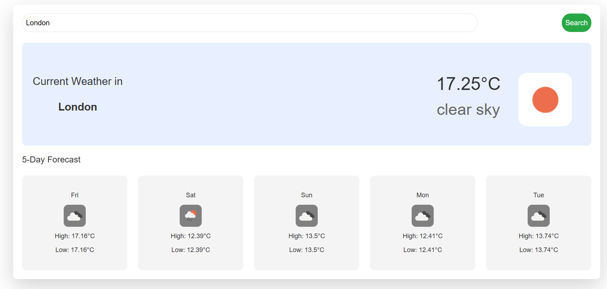

# Weather Dashboard

This is a simple weather dashboard application built with React. It allows users to search for a city and view the current weather conditions along with a five-day weather forecast. The data is fetched from the [OpenWeatherMap API](https://openweathermap.org/).

## Features

- Search for any city to get the current weather.
- View a five-day weather forecast.
- Responsive design for better usability across devices.

## Application Components

- **App.jsx**:  
  The main application component that renders the `WeatherDashboard`.

- **WeatherDashboard.jsx**:  
  This is the main component responsible for managing state and application logic. It fetches the current weather and forecast data and passes it down to other components.  
  **State Variables**:
  - `Data`: Holds the current weather data fetched from the API.
  - `forecastData`: Stores the five-day weather forecast data.
  - `city`: The city name entered by the user.  
  **Functions**:
  - `fetchData(city_name)`: Fetches current weather data for the specified city and calls `fetchForecast`.
  - `fetchForecast(city_name)`: Fetches the five-day weather forecast for the specified city.  
  **Lifecycle Method**:
  - `useEffect`: Calls `fetchData` with "London" as the default city when the component mounts.

- **SearchBox.jsx**:  
  A search component that provides an input field for users to enter a city name and a button to trigger the search. It passes the city name back to the `WeatherDashboard` component.

- **WeatherInfo.jsx**:  
  Displays the current weather information, including temperature, humidity, wind speed, and weather conditions. It receives the weather data as props from the `WeatherDashboard`.

- **Forecast.jsx**:  
  Displays the five-day weather forecast, showing the weather for each day at noon. It receives the forecast data as props from the `WeatherDashboard`.

- **ForecastDay.jsx**:  
  Handles rendering individual forecast days by displaying the weather data for each day. It is used within the `Forecast` component.

## Usage
  -**Clone the repository**:
  git clone https://github.com/yourusername/weather-dashboard.git
  cd weather-dashboard

## Install dependencies
  -**npm install**:

## Get an API Key from OpenWeatherMap
  -**Api-Key Register Details**:
  > Visit OpenWeatherMap and register for a free API key.
  > Once registered, you can find your API key in the OpenWeatherMap dashboard.

## Set up the API Key
  -**Clone the repository**:
  > Create a .env file in the root directory.
  > Add the following line to the .env file, replacing `VITE_WEATHER_API_KEY=YOUR-API-KEY'
